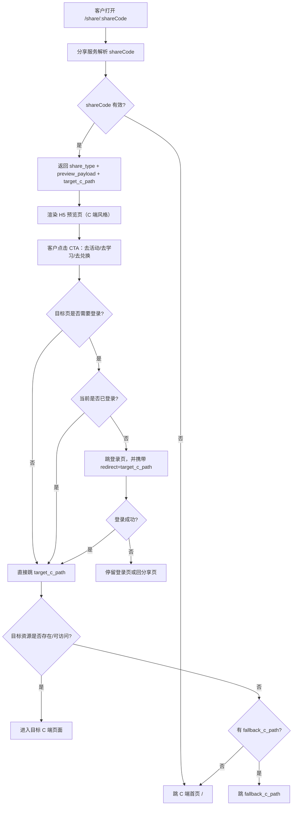

# B 端分享 C 端 H5 落地方案（2026-03-09）

## 1. 背景

当前希望支持 B 端业务员把以下内容分享给客户：

1. 活动
2. 知识学习
3. 积分商城

客户打开分享链接后，应先看到一个接近 C 端体验的 H5 落地页，再按目标内容跳转到 C 端对应页面，而不是统一只落到 C 端首页。

首页只作为最终兜底，不应作为默认跳转策略。

## 2. 目标

1. B 端可一键生成标准化分享链接
2. 客户打开链接后，看到 C 端风格的 H5 预览页
3. H5 可按内容类型跳转到 C 端对应页面
4. 需要登录的内容，支持登录后回跳目标页
5. 内容失效、下线、参数异常时，具备清晰兜底路径
6. 分享链路可埋点、可统计、可回放问题

## 3. 非目标

本轮不做：

1. 个人中心分享
2. 我的订单分享
3. 核销页分享
4. 积分明细分享
5. 任何只适合本人查看的页面分享
6. 直接开放“完成任务/兑换/核销”这类动作型接口给公开分享页

## 4. 现有 C 端基线

当前项目里已有可复用的 C 端页面和能力：

1. 活动页：`src/pages/Activities.tsx`
2. 学习页：`src/pages/Learning.tsx`
3. 商城组件：`src/components/mall/PointsMall.tsx`
4. 个人页中已有课程详情与积分详情弹层：
   - `src/components/learning/CourseDetail.tsx`
   - `src/components/mall/PointsDetailPage.tsx`

当前已存在的公开或半公开接口包括：

1. `GET /api/activities`
2. `GET /api/learning/courses`
3. `GET /api/learning/courses/:id`
4. `GET /api/learning/games`
5. `GET /api/learning/tools`
6. `GET /api/mall/items`

当前登录后动作接口包括：

1. `POST /api/activities/:id/complete`
2. `POST /api/learning/courses/:id/complete`
3. `POST /api/mall/redeem`

结论：

1. 活动、学习、商城都适合做“公开 H5 预览页”
2. 完成活动、完成学习、兑换商品不适合直接暴露为分享落点
3. 动作类链路应统一做成“先预览、再登录、再跳转执行”

## 5. 核心产品规则

1. 所有分享统一先落到 `/share/:shareCode`
2. B 端不直接拼接真实 C 端业务 URL 给客户
3. 有公共详情页的内容，默认跳详情页
4. 需要登录才能继续的内容，先显示预览页，再走登录回跳
5. 私有页面不开放分享
6. 资源失效优先跳频道页，最后才跳 C 端首页
7. 分享落地页要带顾问来源信息和埋点

## 6. 分享路由表

建议统一走一个分享落地层，不让 B 端直接拼 C 端业务页地址。

### 6.1 公网分享地址

统一入口：

- `/share/:shareCode`

### 6.2 内容映射

| share_type | H5 落地页 | C 端目标页 | 兜底页 | 是否建议开放 |
| --- | --- | --- | --- | --- |
| `activity` | `/share/:shareCode` | `/activities?activityId=:id` | `/activities` | 是 |
| `learning_course` | `/share/:shareCode` | `/learning?courseId=:id` | `/learning` | 是 |
| `learning_game` | `/share/:shareCode` | `/learning?tab=games&gameId=:id` | `/learning?tab=games` | 第二批 |
| `learning_tool` | `/share/:shareCode` | `/learning?tab=tools&toolId=:id` | `/learning?tab=tools` | 第二批 |
| `mall_home` | `/share/:shareCode` | `/mall` | `/` | 是 |
| `mall_item` | `/share/:shareCode` | `/mall?itemId=:id` | `/mall` | 是 |

### 6.3 不建议开放的页面

以下页面不做公开分享：

1. `/profile`
2. `/orders`
3. `/redemptions`
4. `/points/transactions`
5. 任意“我的”页面

原因：

1. 强个人属性
2. 无公开阅读价值
3. 容易造成隐私暴露和状态歧义

## 7. 分享数据模型

建议单独建分享域，不把分享配置散落在活动、课程、商品表中。

### 7.1 主表：`b_share_links`

```sql
CREATE TABLE b_share_links (
  id BIGSERIAL PRIMARY KEY,
  share_code VARCHAR(64) NOT NULL UNIQUE,
  tenant_id BIGINT NOT NULL,
  sales_id BIGINT NOT NULL,
  share_type VARCHAR(32) NOT NULL,
  target_id BIGINT,
  target_c_path VARCHAR(512) NOT NULL,
  fallback_c_path VARCHAR(512),
  login_required BOOLEAN NOT NULL DEFAULT FALSE,
  preview_payload JSONB NOT NULL DEFAULT '{}'::jsonb,
  channel VARCHAR(32),
  status VARCHAR(16) NOT NULL DEFAULT 'active',
  expires_at TIMESTAMP NULL,
  view_count INT NOT NULL DEFAULT 0,
  click_count INT NOT NULL DEFAULT 0,
  created_at TIMESTAMP NOT NULL DEFAULT NOW(),
  updated_at TIMESTAMP NOT NULL DEFAULT NOW()
);
```

#### 字段约束建议

`share_type` 取值：

1. `activity`
2. `learning_course`
3. `learning_game`
4. `learning_tool`
5. `mall_home`
6. `mall_item`

`status` 取值：

1. `active`
2. `disabled`
3. `expired`

### 7.2 事件表：`b_share_events`

```sql
CREATE TABLE b_share_events (
  id BIGSERIAL PRIMARY KEY,
  tenant_id BIGINT NOT NULL,
  share_code VARCHAR(64) NOT NULL,
  share_type VARCHAR(32) NOT NULL,
  event_name VARCHAR(64) NOT NULL,
  sales_id BIGINT,
  customer_id BIGINT,
  trace_id VARCHAR(128),
  ua TEXT,
  referer TEXT,
  ip VARCHAR(64),
  extra JSONB NOT NULL DEFAULT '{}'::jsonb,
  created_at TIMESTAMP NOT NULL DEFAULT NOW()
);
```

#### 建议事件名

1. `share_link_created`
2. `share_h5_view`
3. `share_h5_click_cta`
4. `share_jump_c`
5. `share_login_redirect`
6. `share_login_return`
7. `share_target_open_success`
8. `share_target_open_fallback`
9. `share_invalid_code`

## 8. B 端生成分享链接的数据结构

建议后端统一生成 share record，而不是让前端自己拼接目标路径。

### 8.1 标准结构

```json
{
  "share_code": "sh_9XK2M8P4",
  "tenant_id": 1001,
  "sales_id": 20086,
  "share_type": "learning_course",
  "target_id": 345,
  "target_title": "家庭保障入门课",
  "target_c_path": "/learning?courseId=345",
  "fallback_c_path": "/learning",
  "login_required": false,
  "preview_payload": {
    "title": "家庭保障入门课",
    "subtitle": "3分钟看懂家庭保障怎么配",
    "cover": "https://cdn.xxx.com/course-345.png",
    "tag": "知识学习",
    "points_hint": 20,
    "cta_text": "去学习"
  },
  "channel": "wechat",
  "status": "active",
  "expires_at": "2026-04-30T23:59:59+08:00"
}
```

### 8.2 需要登录的分享项

```json
{
  "share_type": "activity",
  "target_id": 901,
  "target_c_path": "/activities?activityId=901",
  "fallback_c_path": "/activities",
  "login_required": true,
  "action_type": "view_then_join"
}
```

### 8.3 推荐补充追踪字段

```json
{
  "trace_id": "share_20260309_xxx",
  "utm": {
    "source": "b_portal",
    "medium": "share",
    "campaign": "sales_activity"
  }
}
```

## 9. API 设计草案

### 9.1 B 端生成分享链接

`POST /api/b/shares`

请求：

```json
{
  "shareType": "mall_item",
  "targetId": 9001,
  "channel": "wechat"
}
```

返回：

```json
{
  "shareCode": "sh_9XK2M8P4",
  "shareUrl": "https://h5.xxx.com/share/sh_9XK2M8P4",
  "shareType": "mall_item",
  "targetCPath": "/mall?itemId=9001",
  "fallbackCPath": "/mall",
  "loginRequired": false,
  "previewPayload": {
    "title": "居家健康礼包",
    "subtitle": "积分可兑，限时上新",
    "cover": "https://cdn.xxx.com/mall/item-9001.png",
    "ctaText": "去兑换"
  }
}
```

### 9.2 B 端查询分享历史

`GET /api/b/shares?shareType=mall_item&status=active`

返回字段建议：

1. `shareCode`
2. `shareUrl`
3. `targetId`
4. `viewCount`
5. `clickCount`
6. `status`
7. `createdAt`

### 9.3 H5 解析分享内容

`GET /api/share/:shareCode`

返回：

```json
{
  "valid": true,
  "shareType": "activity",
  "targetId": 901,
  "targetCPath": "/activities?activityId=901",
  "fallbackCPath": "/activities",
  "loginRequired": true,
  "previewPayload": {
    "title": "春季打卡活动",
    "subtitle": "连续参与可得积分奖励",
    "cover": "https://cdn.xxx.com/activity-901.png",
    "ctaText": "立即参与"
  }
}
```

### 9.4 H5 查看埋点

`POST /api/share/:shareCode/view`

### 9.5 H5 点击 CTA 埋点

`POST /api/share/:shareCode/click`

## 10. C 端 H5 落地页交互流程

### 10.1 流程说明

1. 客户打开 `/share/:shareCode`
2. H5 调 `GET /api/share/:shareCode`
3. 根据 `share_type` 渲染成对应 C 端风格
4. 点击 CTA 时决定是否需要登录
5. 已登录则直接跳目标页
6. 未登录则跳登录页，并携带 `redirect`
7. 登录成功回目标页
8. 目标页无效则走 `fallback_c_path`
9. 最终兜底才是首页

### 10.2 Mermaid 流程图



## 11. 前端页面结构拆分

建议只做一个统一分享落地页，不要每类业务各写一套独立页面。

### 11.1 页面组件建议

1. `ShareLandingPage`
2. `ShareHero`
3. `ShareMeta`
4. `ShareCTA`
5. `ShareInvalidState`
6. `ShareExpiredState`

### 11.2 逻辑分层建议

#### `ShareLandingPage`

职责：

1. 读取 `shareCode`
2. 调 `GET /api/share/:shareCode`
3. 根据 `shareType` 组织渲染数据
4. 控制 CTA 跳转

#### `ShareRenderer`

职责：

1. 根据 `shareType` 选模板
2. 保持整体仍然是统一的 C 端视觉语言

#### `resolveJumpTarget()`

职责：

1. 决定目标页
2. 处理登录回跳
3. 处理 fallback

伪代码：

```ts
function resolveJumpTarget(detail) {
  if (!detail.valid) return '/';

  if (detail.loginRequired && !isLoggedIn()) {
    return `/login?redirect=${encodeURIComponent(detail.targetCPath)}`;
  }

  return detail.targetCPath || detail.fallbackCPath || '/';
}
```

## 12. 页面线框图

### 12.1 分享落地页

```text
+--------------------------------------------------+
| 顶部品牌/Logo                                     |
|                                                  |
| [封面图]                                          |
|                                                  |
| 标签：活动 / 课程 / 商城                          |
| 标题：春季健康挑战营                              |
| 副标题：完成任务可得积分奖励                      |
|                                                  |
| 亮点信息1                                         |
| 亮点信息2                                         |
| 亮点信息3                                         |
|                                                  |
| [立即查看 / 去学习 / 去兑换] 主按钮               |
| [打开首页] 次按钮                                 |
|                                                  |
| 底部说明：由 XX 顾问分享                          |
+--------------------------------------------------+
```

### 12.2 失效页

```text
+--------------------------------------------------+
| 图标/插画                                         |
| 页面来晚了                                        |
| 该分享内容已失效或已下线                          |
|                                                  |
| [去首页]                                          |
| [去活动页/学习页/商城页]                          |
+--------------------------------------------------+
```

### 12.3 登录回跳链路

```text
分享页 -> 点击 CTA -> 登录页 -> 登录成功 -> 目标页
```

## 13. 测试方案

不是一开始就必须上云，但最后必须有“公网可访问 + 真机测试”这一层。

### 13.1 第 1 层：本地浏览器测试

目标：验证页面和跳转逻辑本身。

检查项：

1. 分享页是否正确渲染成 C 端样式
2. `shareCode` 是否能正确拿到数据
3. CTA 是否跳到正确页面
4. 未登录是否先去登录，再回跳
5. 参数丢失时是否兜底到首页或频道页

结论：

1. 这一步不需要上云
2. 适合开发联调和快速修问题

### 13.2 第 2 层：手机局域网测试

目标：验证手机真实浏览效果。

方式：

1. 前端本地启动 dev server
2. 手机和电脑连同一 Wi-Fi
3. 手机通过 `http://电脑IP:端口` 访问

检查项：

1. 手机样式是否正确
2. 页面滚动、点击、弹层是否正常
3. 登录回跳是否通
4. 频道页和详情页跳转是否正常

结论：

1. 这一步也不一定要上云
2. 适合前期真机体验验证

### 13.3 第 3 层：公网预览环境测试

以下场景建议必须使用公网地址：

1. 微信里点开分享
2. 企业微信里点开分享
3. 短信/外链打开
4. H5 要求 HTTPS
5. H5 要求真实分享卡片、真实回跳链路

推荐方式：

1. 临时隧道：
   - `ngrok`
   - `Cloudflare Tunnel`
   - `localtunnel`
2. 稳定预发：
   - preview deployment
   - staging 域名

结论：

1. 如果只是验证流程，临时隧道够用
2. 如果要测完整分享链路，最好有稳定 preview/staging 域名

### 13.4 第 4 层：真机最终验收

最终必须真机测试，电脑模拟器不够。

最少要测：

1. B 端生成分享链接
2. 把链接发到微信/企微/短信
3. 客户在手机里打开分享 H5
4. H5 是否正确展示
5. 点击 CTA 是否到目标页
6. 未登录是否先登录再回跳
7. 目标页失效时是否走 fallback
8. iPhone 和 Android 各测一轮

### 13.5 推荐最小测试路径

如果要最快验证，建议顺序：

1. 本地浏览器测通页面与跳转逻辑
2. 局域网手机测试 UI 与回跳
3. 公网临时地址测分享出去后的打开链路
4. 稳定后再上 staging，不要直接打生产

## 14. 开发任务拆解

### 14.1 后端任务

1. 建 `b_share_links`
2. 建 `b_share_events`
3. 实现 `POST /api/b/shares`
4. 实现 `GET /api/share/:shareCode`
5. 实现 `POST /api/share/:shareCode/view`
6. 实现 `POST /api/share/:shareCode/click`
7. 实现失效、禁用、过期校验
8. 实现 `target_c_path` / `fallback_c_path` 生成规则

### 14.2 前端任务

1. 新增 `/share/:shareCode`
2. 新增统一分享落地页组件
3. 新增失效页组件
4. 新增 CTA 跳转逻辑
5. 新增登录回跳逻辑
6. 新增埋点上报

### 14.3 B 端任务

1. 活动页加“分享”按钮
2. 课程页加“分享”按钮
3. 商城首页加“分享”按钮
4. 商品页加“分享”按钮
5. 分享弹窗展示：
   - 标题
   - 链接
   - 二维码
   - 复制按钮

### 14.4 测试任务

1. 本地浏览器测试
2. 手机局域网测试
3. 公网预览环境测试
4. 微信/企微真机测试
5. 登录回跳测试
6. 资源失效兜底测试

## 15. 分阶段上线建议

### 15.1 第一阶段

1. 商城首页分享
2. 商城商品分享
3. 课程分享
4. 通用分享落地页

### 15.2 第二阶段

1. 活动分享
2. 登录回跳优化
3. 分享埋点报表

### 15.3 第三阶段

1. 二维码海报
2. 顾问个性化分享卡片
3. 分享效果统计面板

## 16. 推荐先做的范围

建议优先做：

1. `activity`
2. `learning_course`
3. `mall_home`
4. `mall_item`

第二批再做：

1. `learning_game`
2. `learning_tool`

先不要做：

1. 订单分享
2. 核销分享
3. 个人积分明细分享
4. 个人中心分享

## 17. 风险与依赖

### 17.1 风险

1. C 端当前部分页面是页内弹层模式，分享落地到独立 H5 时需要单独抽页面态
2. 目标 C 端路由如果没有标准 URL 结构，后续会导致分享映射漂移
3. 登录回跳如果没有统一实现，分享链路会出现黑洞
4. 微信/企微内打开时，HTTPS、域名白名单、分享卡片配置可能成为阻塞项
5. 如果 B 端直接拼 URL 而不是走后端 share record，后续治理会失控

### 17.2 依赖

1. C 端需要明确标准路由和 query 约定
2. 后端需要提供 share record 查询接口
3. B 端需要统一分享弹窗和生成入口
4. 测试环境需要至少一个可公网访问的预览域名

## 18. 最终结论

1. 业务员分享活动、学习、积分商城给客户是可行的
2. 正确方案不是“统一跳首页”，而是“统一分享落地页 + 定向跳转 + 首页兜底”
3. 第一版应优先覆盖活动、课程、商城首页、商城商品四类分享
4. 真正上线前必须完成公网环境和真机测试
