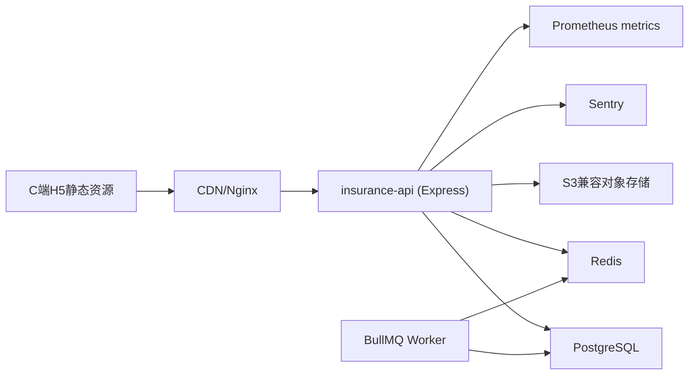

# insurance_code 部署拓扑（v1）

更新时间：2026-02-23

## 1. 环境拓扑（dev/test/staging/prod）

### 1.1 环境职责
- `dev`：本地开发，允许mock与调试日志。
- `test`：功能测试环境，供QA与接口测试。
- `staging`：预发布，配置与prod等价，灰度回归。
- `prod`：生产环境，限制调试开关，开启完整告警。

### 1.2 最小资源建议
- API：2副本（2C4G）起步，支持水平扩容。
- PostgreSQL：4C8G + SSD，开启自动备份。
- Redis：主从/哨兵（最少1主1从）。
- Worker：1副本起步（异步任务量低）。

## 2. 网络与安全边界

- API仅开放`443`，数据库和Redis仅内网访问。
- 对象存储使用临时签名URL上传，不暴露永久密钥。
- 所有环境分离密钥：`JWT_SECRET`、`DATABASE_URL`、`REDIS_URL`、`S3_*`。
- WAF/网关规则：登录与验证码限流。

## 3. 发布流程（staging -> prod）

1. 合并到`release/*`分支触发CI。
2. 执行：lint -> unit -> contract test -> migration check。
3. 部署staging并跑冒烟（实名/签到/兑换/核销）。
4. 审批后蓝绿或滚动发布到prod。
5. 发布后10分钟重点观测：5xx、P95、DB连接、Redis命中。

负责人建议：
- CI/CD与部署：DevOps负责人
- 发布验收：后端负责人 + QA负责人

## 4. 回滚方案

### 4.1 应用回滚
- 保留最近3个镜像Tag，失败时一键回滚上一Tag。

### 4.2 数据回滚
- 仅允许“向前修复”迁移；禁止线上直接DROP关键表。
- 每次发布前自动快照；出现数据问题走恢复流程：
  1. 锁写入口
  2. 恢复最近快照到新实例
  3. 校验后切换连接

## 5. 可观测与告警

- 指标：`http_requests_total`、`http_request_duration_ms`、`db_pool_in_use`、`redis_errors_total`。
- 业务指标：`points_grant_success_total`、`redeem_success_total`、`writeoff_conflict_total`。
- 告警阈值：
  - 5xx > 2%（5分钟）
  - 核心接口P95 > 800ms（连续10分钟）
  - DB可用连接 < 20%
  - Redis不可用 > 1分钟

## 6. 关键决策与取舍

- 决策：v1不引入K8s复杂编排，优先容器化+滚动发布。
- 取舍：牺牲部分弹性能力，换取2周内上线确定性。
- 决策：消息能力采用Redis+BullMQ，不单独上MQ集群。
- 取舍：吞吐上限较低，但运维复杂度显著下降。

## 7. 落地实施步骤与负责人建议

1. 准备四套环境参数模板（DevOps负责人）。
2. 创建staging与prod资源并做网络隔离（DevOps负责人）。
3. 打通CI/CD与镜像仓库（DevOps负责人）。
4. 集成Prometheus/Sentry与告警规则（DevOps+后端负责人）。
5. 执行staging全链路冒烟（QA负责人）。
6. 组织一次生产发布与回滚演练（DevOps负责人）。
7. 发布后连续48小时观测与复盘（技术负责人牵头）。
