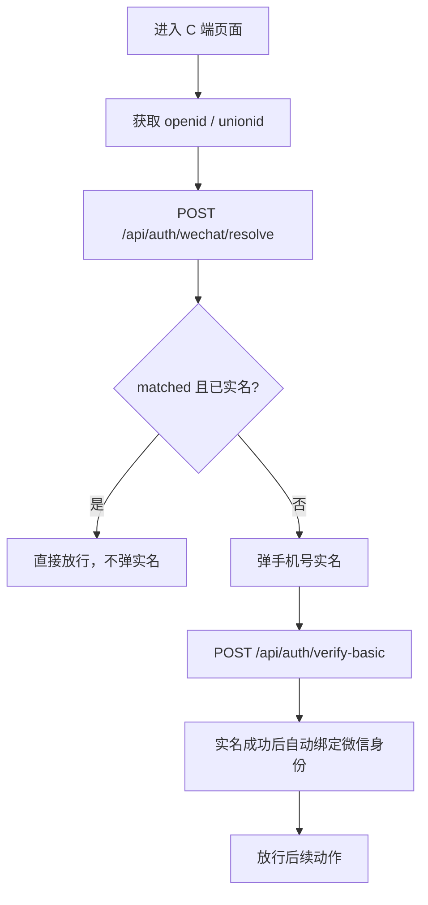
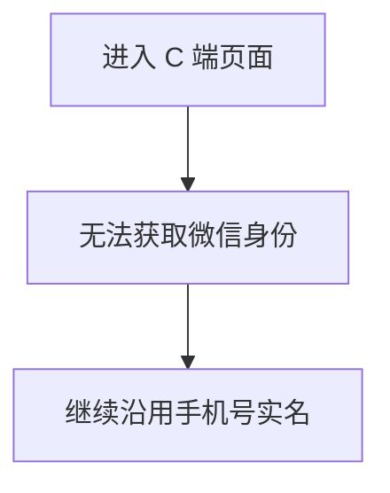

# 微信身份绑定与免二次实名实施方案（2026-03-16）

## 1. 背景

当前 C 端实名主链路是：

1. 输入真实姓名
2. 输入手机号
3. 发送验证码
4. 调用 `POST /api/auth/verify-basic`
5. 成功后建立客户会话，并允许继续参与活动、学习、商城等动作

这套链路在普通浏览器下可用，但在微信生态内存在一个明显体验问题：

1. 客户第一次实名成功后
2. 后续再次从微信内 H5 或微信小程序进入
3. 系统仍然可能再次弹出实名

这会直接拉低分享转化、活动报名完成率和学习完课率。

当前工程已经具备一部分前置条件：

1. 客户主表 `c_customers` 已存在：
   - `wechat_open_id`
   - `wechat_union_id`
2. C 端已经具备分享链路和实名门槛
3. 客户归属逻辑已经围绕分享链路和业务员归属在运行

缺的不是字段本身，而是：

1. 微信身份绑定规则
2. 免二次实名判断规则
3. 冲突处理规则
4. 对应接口和前后端收口方案

## 2. 目标

本方案目标是：

1. 客户首次在微信环境完成实名后，将微信身份与客户档案绑定
2. 同一客户后续再次从微信环境进入时，不再重复实名
3. 分享链路下的新客户仍然归属于原业务员，不归属于分享客户本人
4. 不改变非微信环境下现有手机号实名流程
5. 保持冲突可控，不自动覆盖旧绑定

## 3. Why Now

现在做这件事有明确收益：

1. 微信分享是高频获客入口，重复实名直接影响转化
2. 当前客户归属、分享埋点、实名主链路都已经在位，正好适合补这层绑定能力
3. `c_customers` 已经有 `wechat_open_id` / `wechat_union_id`，落地成本低
4. 如果继续拖，后续会出现更多“为什么已经实名还要再实名”的线上解释成本

## 4. 范围

### 4.1 本轮范围

1. 微信小程序
2. 微信内 H5
3. C 端实名流程
4. 分享 H5 进入后的实名豁免逻辑
5. 客户与微信身份绑定

### 4.2 非目标

本轮不做：

1. 普通浏览器免实名
2. 第三方 App 内置浏览器免实名
3. 微信登录体系重构
4. 客户跨租户合并
5. 旧历史客户自动批量回填微信身份
6. “实名状态”替换为“微信身份状态”

实名是否已完成，仍然以业务字段 `is_verified_basic` 为准。

## 5. 核心定义

### 5.1 `openid`

含义：

1. 同一个微信用户
2. 在一个具体微信应用（公众号/小程序）内的唯一 ID

适用：

1. 单应用内识别同一客户

局限：

1. 不能天然跨公众号/小程序统一

### 5.2 `unionid`

含义：

1. 同一个微信用户
2. 在同一微信开放平台主体下的一组应用中的统一 ID

适用：

1. 小程序 + 微信内 H5 + 公众号统一识别

结论：

1. 绑定优先级必须是 `unionid > openid`

### 5.3 `wechat_app_type`

含义：

1. 本次微信身份来自哪个微信接入类型

建议值：

1. `mini_program`
2. `mp`
3. `h5`

### 5.4 `wechat_bound_at`

含义：

1. 客户与微信身份首次绑定成功的时间

用途：

1. 审计
2. 纠纷排查
3. 免实名生效时间判断

## 6. 当前基线

当前客户表已有字段：

1. `wechat_open_id`
2. `wechat_union_id`
3. `is_verified_basic`
4. `verified_at`

当前认证主接口已有：

1. `POST /api/auth/send-code`
2. `POST /api/auth/verify-basic`

因此，本方案不是从零开始搭建，而是在现有实名体系上补齐：

1. 微信身份解析
2. 微信身份绑定
3. 免实名判定

## 7. 业务规则

### 7.1 首次实名

客户第一次在微信环境进入：

1. 前端先获取微信身份
   - 优先 `unionid`
   - 次级 `openid`
2. 如果找不到已绑定客户
3. 继续走手机号实名
4. 实名成功后，自动把微信身份绑定到当前客户

### 7.2 后续再次进入

客户后续再次进入微信环境：

1. 前端获取当前微信身份
2. 调用微信身份解析接口
3. 如果命中已绑定客户
4. 且该客户 `is_verified_basic = true`
5. 则直接放行，不再弹实名

### 7.3 绑定优先级

固定规则：

1. 优先按 `unionid` 解析
2. 没有 `unionid` 时，再按 `openid` 解析

### 7.4 分享链路下的新客户归属

分享链路必须保持当前业务规则：

1. 分享链接里的 `salesId`
2. 决定新客户归属于哪个业务员

也就是说：

1. A 客户分享了 C 端页面
2. B 新客户点开分享并实名
3. B 客户最终归属的仍然是 A 客户所属业务员
4. 不是归属于 A 客户本人

微信身份绑定只解决：

1. “是否需要再次实名”

不改变：

1. “新客户归属于哪个业务员”

### 7.5 冲突规则

本轮必须严格执行：

1. 一个 `unionid` 只能绑定一个客户
2. 一个 `openid + wechat_app_type` 只能绑定一个客户
3. 如果命中其他客户，不自动覆盖
4. 返回明确冲突码，由业务或运营介入处理

### 7.6 非微信环境

非微信环境下：

1. 不尝试免实名
2. 继续沿用手机号实名

包括：

1. PC 浏览器
2. 手机系统浏览器
3. 第三方 App 内置浏览器

## 8. 数据模型

### 8.1 当前保留字段

继续使用：

1. `wechat_open_id VARCHAR(64)`
2. `wechat_union_id VARCHAR(64)`

### 8.2 建议新增字段

```sql
ALTER TABLE c_customers
  ADD COLUMN IF NOT EXISTS wechat_app_type VARCHAR(32);

ALTER TABLE c_customers
  ADD COLUMN IF NOT EXISTS wechat_bound_at TIMESTAMPTZ;
```

### 8.3 建议索引

当前产品假设是：

1. 一个微信身份只归属一个客户

在这个假设下，建议增加：

```sql
CREATE UNIQUE INDEX IF NOT EXISTS ux_c_customers_wechat_union_id
  ON c_customers (wechat_union_id)
  WHERE wechat_union_id IS NOT NULL;

CREATE UNIQUE INDEX IF NOT EXISTS ux_c_customers_wechat_app_open_id
  ON c_customers (wechat_app_type, wechat_open_id)
  WHERE wechat_open_id IS NOT NULL;
```

说明：

1. `unionid` 做全局唯一
2. `openid` 按 `wechat_app_type + openid` 唯一

如果后续明确允许“同一微信身份跨租户并存”，这组约束需要重新评审。

## 9. 接口设计

### 9.1 `POST /api/auth/wechat/resolve`

用途：

1. 根据当前微信身份判断是否已经有实名客户
2. 决定是否可直接跳过实名

请求：

```json
{
  "openId": "openid_xxx",
  "unionId": "unionid_xxx",
  "appType": "mini_program"
}
```

响应：

```json
{
  "matched": true,
  "customerId": 123,
  "isVerifiedBasic": true,
  "skipVerify": true
}
```

规则：

1. 先按 `unionId` 查
2. 没有 `unionId` 再按 `appType + openId` 查
3. 命中且 `isVerifiedBasic = true`，返回 `skipVerify = true`
4. 未命中则返回：

```json
{
  "matched": false,
  "skipVerify": false
}
```

### 9.2 `POST /api/auth/wechat/bind`

用途：

1. 在实名成功后，把微信身份绑定到客户

请求：

```json
{
  "customerId": 123,
  "openId": "openid_xxx",
  "unionId": "unionid_xxx",
  "appType": "mini_program"
}
```

响应：

```json
{
  "ok": true
}
```

规则：

1. 不允许覆盖已绑定到其他客户的 `unionid/openid`
2. 只允许给当前实名成功客户做绑定

### 9.3 `POST /api/auth/verify-basic`

本轮不改接口语义，只扩展可选字段：

```json
{
  "name": "张三",
  "mobile": "13800000000",
  "code": "123456",
  "openId": "openid_xxx",
  "unionId": "unionid_xxx",
  "appType": "mini_program"
}
```

成功后动作：

1. 完成业务实名
2. 建立会话
3. 如果请求里带微信身份，则自动绑定

## 10. 前端流程

### 10.1 微信环境



### 10.2 非微信环境



## 11. 错误码建议

| 错误码 | HTTP | 含义 | 处理建议 |
| --- | --- | --- | --- |
| `WECHAT_IDENTITY_CONFLICT` | 409 | `unionid/openid` 已绑定其他客户 | 不自动覆盖，转人工处理 |
| `WECHAT_IDENTITY_INVALID` | 400 | 微信身份参数不完整或非法 | 前端重试或退回手机号实名 |
| `WECHAT_APP_TYPE_INVALID` | 400 | `appType` 非法 | 修正前端参数 |
| `NEED_BASIC_VERIFY` | 403 | 当前客户尚未完成业务实名 | 弹实名 |

说明：

1. `matched=false` 不是错误
2. 它只是表示“没有绑定历史，需要继续实名”

## 12. 推荐落地顺序

### Phase 1：数据层收口

1. 补 `wechat_app_type`
2. 补 `wechat_bound_at`
3. 加唯一索引

### Phase 2：后端解析与绑定

1. 增加 `POST /api/auth/wechat/resolve`
2. 增加 `POST /api/auth/wechat/bind`
3. 扩展 `POST /api/auth/verify-basic`

### Phase 3：前端免实名流程

1. 微信环境先走 `resolve`
2. 命中实名客户后直接跳过实名
3. 非命中继续走手机号实名

### Phase 4：分享链路联调

1. 已归属客户发起分享
2. 新客户打开并实名
3. 新客户归属仍按分享业务员走
4. 后续该客户再次从微信进入可免实名

## 13. 影响文件建议

后端建议优先落这些位置：

1. `server/skeleton-c-v1/common/state.mjs`
2. `server/skeleton-c-v1/routes/auth.routes.mjs`
3. `server/skeleton-c-v1/usecases/auth-write.usecase.mjs`
4. `server/skeleton-c-v1/services/share.service.mjs`

前端建议优先落这些位置：

1. `src/lib/api.ts`
2. `src/App.tsx`
3. 分享 H5 入口页
4. 微信环境身份初始化模块

## 14. 验收标准

### 14.1 P0 验收

1. 微信小程序内，已实名老客户再次进入，不弹实名
2. 微信内 H5，已实名老客户再次进入，不弹实名
3. 首次实名成功后，客户记录完成微信身份绑定
4. 分享链路下新客户仍归属于原业务员
5. 非微信环境下，仍按手机号实名，不出现误放行

### 14.2 P1 验收

1. 冲突时返回 `WECHAT_IDENTITY_CONFLICT`
2. 审计日志能看到绑定时间
3. 可定位客户是通过哪个微信应用完成绑定

## 15. 风险与注意事项

1. 微信身份不是业务实名结果
2. `openid/unionid` 只能做“微信身份识别”，不能替代业务实名认证
3. 当前第三方 App 内置浏览器不适合拿这套能力做免实名判断
4. 历史老客户如果还没有绑定微信身份，需要在下一次成功实名后补绑定
5. 如果未来要支持“一个自然人跨多个租户独立存在”，当前唯一索引策略需要重新设计

## 16. 决策结论

本方案建议正式采用以下口径：

1. 微信环境下，`unionid` 优先、`openid` 兜底识别客户
2. 命中且客户已完成业务实名，则免二次实名
3. 首次实名成功后，自动绑定微信身份
4. 分享链路中的客户归属仍然以分享对应业务员为准
5. 普通浏览器和第三方 WebView 不纳入本轮免实名范围
