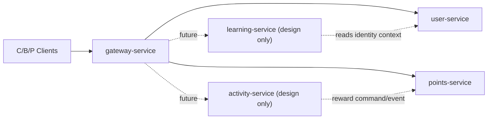

# Week12 总设计包收口（A 号）

更新时间：2026-03-08  
负责人：A 号  
范围：`activity-service`、`learning-service` 设计评审与模板收口  
边界：只做设计、模板、汇总、归档；不拆新服务代码

## 1. 结论

Week12 的目标不是继续拆服务，而是把下一批服务拆分准备成可执行设计包。

本轮结论：

1. `activity-service` 可以进入设计评审，不进入代码开拆
2. `learning-service` 可以进入设计评审，不进入代码开拆
3. 两个服务都必须复用当前冻结的鉴权口径、租户上下文和灰度治理基线
4. `user-service` 的身份/客户/session 主写边界不动
5. `points-service` 的账务/订单/核销主写边界不动
6. Week13+ 可以进入“先模板、后试点、再运行时接线”的执行阶段

## 2. 背景与约束

当前生产化基线已经完成：

1. Week5：运行时拆分
2. Week6：主写边界与统一 gate
3. Week7：trace / metrics / observability
4. Week8：发布回退与上线标准
5. Week9-Week11：部署、实库、灰度、回退、正式演练

因此 Week12 只做下一批服务拆分的设计准备，不再破坏现有三服务稳定性。

## 3. 当前统一上下文图

## 4. B/C 边界评审输入汇总

### 4.1 来自 B 号的输入：learning-service

来源：

1. `./week12-learning-service-boundary-review-from-user-domain-2026-03-07.md`
2. `../server/microservices/user-service/contract.md`

统一结论：

1. `learning-service` 不得主写：
   - `app_users`
   - `c_customers`
   - `p_sessions`
2. `learning-service` 可以主写：
   - `p_learning_materials`
   - `c_learning_records`
3. `learning-service` 必须复用：
   - `Authorization: Bearer <token>`
   - `x-csrf-token`
   - 共享身份上下文：`user_id / tenant_id / actorType / org_id / team_id`
4. `learning-service` 不接管：
   - `POST /api/auth/send-code`
   - `POST /api/auth/verify-basic`
   - `GET /api/me`

### 4.2 来自 C 号的输入：activity-service

来源：

1. `../server/microservices/points-service/WEEK12-ACTIVITY-SERVICE-REVIEW.md`
2. `../server/microservices/points-service/CONTRACT.md`
3. `../server/microservices/points-service/BOUNDARY.md`

统一结论：

1. `activity-service` 不得主写：
   - `c_point_accounts`
   - `c_point_transactions`
   - `p_orders`
   - `c_redeem_records`
   - `c_sign_ins`
2. `activity-service` 可以拥有：
   - 活动定义
   - 活动规则
   - 活动参与记录
   - 活动完成判定
   - 奖励申请发起
3. 活动奖励最终落账必须继续由 `points-service` 执行
4. Week12 不决定“同步命令”还是“事件驱动”最终上线方案，只把两种方案模板化

## 5. 服务边界建议

### 5.1 learning-service

建议职责：

1. 学习资料内容管理
2. 学习资料列表/详情
3. 学习完成记录
4. 学习类运营统计

不承担：

1. 登录协议
2. `/api/me`
3. 客户主档
4. 积分账户和积分账本

### 5.2 activity-service

建议职责：

1. 活动配置与生命周期
2. 活动参与资格校验
3. 活动完成判定
4. 活动侧统计和运营编排
5. 奖励落账请求发起

不承担：

1. 积分账户主写
2. 积分流水主写
3. 订单主写
4. 核销主写

## 6. 推荐 owned routes

### 6.1 learning-service 候选 owned routes

1. `GET /api/learning/courses`
2. `GET /api/learning/courses/:id`
3. `POST /api/learning/courses/:id/complete`
4. `GET /api/learning/games`
5. `GET /api/learning/tools`
6. `GET /api/p/learning/courses`
7. `POST /api/p/learning/courses`
8. `PUT /api/p/learning/courses/:id`
9. `DELETE /api/p/learning/courses/:id`

### 6.2 activity-service 候选 owned routes

1. `GET /api/activities`
2. `GET /api/activities/:id`
3. `POST /api/activities/:id/join`
4. `POST /api/activities/:id/complete`
5. `GET /api/p/activities`
6. `POST /api/p/activities`
7. `PUT /api/p/activities/:id`
8. `DELETE /api/p/activities/:id`
9. `POST /api/p/activities/:id/publish`

说明：

1. 上面是设计包候选，不代表 Week12 立即迁移
2. 现有 `points-service` 中与“活动奖励落账”强耦合的写链路，Week12 不迁

## 7. 主写表建议

### 7.1 learning-service

建议主写：

1. `p_learning_materials`
2. `c_learning_records`

### 7.2 activity-service

建议新增后再主写的对象：

1. `p_activity_templates`
2. `p_activity_rules`
3. `c_activity_participations`
4. `c_activity_completion_records`

说明：

1. 这些表名是设计模板占位，不要求 Week12 落库
2. 真正落表前必须先补 ownership matrix 和 gate

## 8. 集成与协作建议

### 8.1 learning-service 与 user-service

交互方式：

1. 只读共享身份上下文
2. 不复制 token/session 存储
3. 不直接改 user 主档

### 8.2 activity-service 与 points-service

建议准备两套模板：

1. 同步命令式奖励落账
2. 事件驱动式奖励落账

统一原则：

1. 幂等 key 必须先定义
2. 奖励是否成功，以 `points-service` 结果为准
3. 失败补偿不能靠跨域直写

## 9. 风险与取舍

### 9.1 风险

1. 如果现在直接开拆 `activity-service`，最容易打穿 `points-service` 的账务边界
2. 如果现在直接开拆 `learning-service`，最容易打穿 `user-service` 的身份与 session 边界
3. 如果先改代码再补 gate，会复用 Week5-Week11 之前的临时做法

### 9.2 取舍

1. Week12 先交模板和总设计包，不交运行时代码
2. Week13 先做最小试点，不直接做双服务并行大迁移
3. 先冻结边界、再做试点接线，比直接拆更稳

## 10. Week12 总设计结论

1. `learning-service` 可作为“内容与学习完成记录”服务设计推进
2. `activity-service` 可作为“活动配置与完成判定”服务设计推进
3. `user-service` 与 `points-service` 的主写边界继续保持冻结
4. 下一阶段必须先补 gate / smoke / release-check 模板，再进入 Week13 试点

## 11. 关联文档

1. `./week12-learning-service-boundary-review-from-user-domain-2026-03-07.md`
2. `../server/microservices/points-service/WEEK12-ACTIVITY-SERVICE-REVIEW.md`
3. `./week12-activity-service-design-template-2026-03-08.md`
4. `./week12-learning-service-design-template-2026-03-08.md`
5. `./week12-gate-smoke-release-check-template-2026-03-08.md`
6. `./week12-week13-plus-execution-recommendations-2026-03-08.md`
